# Network Analysis with Gephi

### What is a graph?

A **graph, or network** is a data model consisting of **nodes (vertices)** and the connections between them, also called **edges (links, arcs)**. Networks provide clear and intuitive visual representations of relationships, where nodes typically represent individual entities (such as people, organizations, or objects), and edges signify the connections or interactions between them. These networks appear in various contexts, including social, technological, and biological systems.

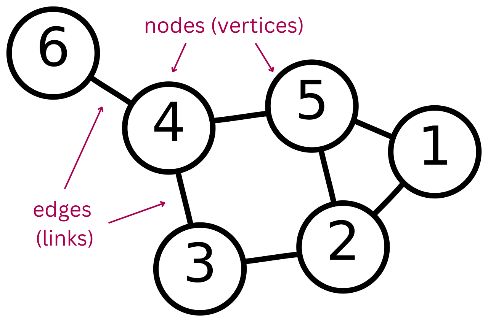

For example, this is what the internet looks like, represented as a graph of IP addresses.

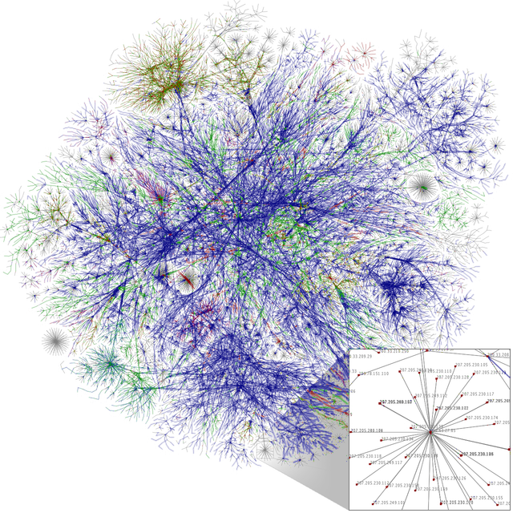

_Image source: Wikimedia_

### What types of graphs are there?

Graphs can be described in the following terms:

* **directed** and **undirected** (connections as arrows vs connections as lines)
* **connected** and **disconnected** (all nodes are connected vs some nodes are isolated from the main graph)
* **weighted** and **unweighted** (connections have numerical values vs they do not)

For example, looking at the London Underground, stations can be viewed as nodes, and tracks connecting them serve as edges. When calculating travel time, you are working with a weighted graph, where each track segment between two stations is assigned a time value in minutes.

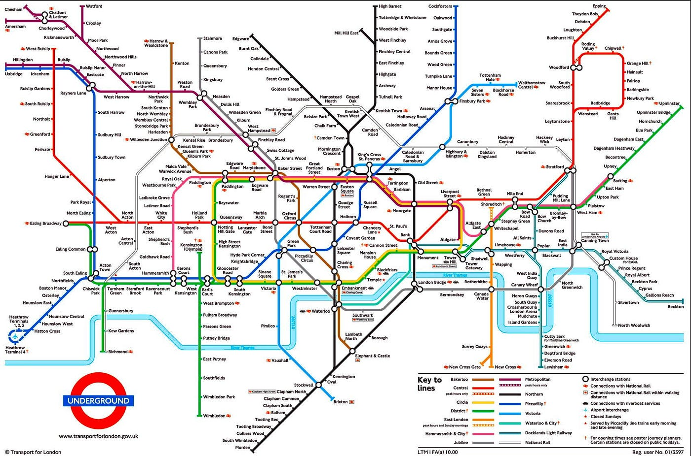

_Image source: [Transport for London](https://tfl.gov.uk/)_

### Social network analysis

**Social network analysis (SNA)**, or simply **network analysis (NA)**, is a research method used to understand and visualise how networks function, and to identify the most important nodes within them. It involves analysing the connections between entities, as well as the characteristics of the entities themselves.

_Image source: [VisibleNetworksLabs](https://visiblenetworklabs.com/guides/social-network-analysis-101/)_

### Communities

Nodes in graphs can be grouped into communities. A **community** is a dense subgraph where all (or almost all) nodes are interconnected. 

_Image source: [TDS Archive](https://medium.com/data-science/community-detection-algorithms-9bd8951e7dae)_

### Graph metrics

A **metric** is a quantifiable measure used to describe and compare models, processes and performance, e.g. _customer retention rate_ or _the number of users visiting your website_. When comparing multiple items, the outcome of the comparison will depend on the metric used. For example, when comparing the research output of different academics, using the _number of publications_ as a metric would rank the researcher with the most articles published as the highest. However, if you use _citation count_ as a metric, the researcher whose work is most frequently cited, even if they have fewer publications, may be considered more influential. 

In graph theory and network analysis, the following metrics are commonly used.

**Degree** is the number of connections a node has.

**Weighted degree** is the number of connections of a node divided by the total number of connections in the graph.

There is a number of ways to measure the importance of a node.

* **Degree centrality**:  the more connections a node has, the more important it is.
* **Closeness centrality**: the more central a node is (i.e., the shorter the path from it to all other nodes), the more important it is.
* **Betweenness centrality**: the more often a node connects two other nodes, the more important it is.
* **Eigencentrality**: " the more friends your friends have, the more important you are".

**Assortativity coefficient** determines with whom the "important" nodes are connected: if they are connected with other "important" nodes, the coefficient value is high, otherwise, it is low.

**Clustering coefficient** is the degree of interaction between a node's immediate neighbors, i.e., the probability that the node's closest neighbors are not only connected to it but also to each other.

**Density** is the ratio of the number of edges to the maximum possible number of edges. Communities tend to have a high clustering coefficient and high density.

**Modularity** measures how much denser the connections within a group are compared to the connections between groups. This metric is used to partition the graph into communities.

### Graph formats

Graphs are usually stored in text files (.gml, .csv) or in XML files (.graphml, .gexf), where all the nodes, edges, and their attributes – for example, the name of a node or the weight of an edge – are listed. This is what .gml and .gexf files look like, respectively.

#### gml

A coappearance network of characters in the novel _Les Misérables_ by Victor Hugo ([lesmis.gml](./data/lesmis.gml)).

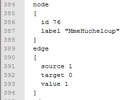

#### csv

A co-occurrence network of the characters in the Game of Thrones ([GoT_Book1.csv](./data/GoT_Book1.csv)).

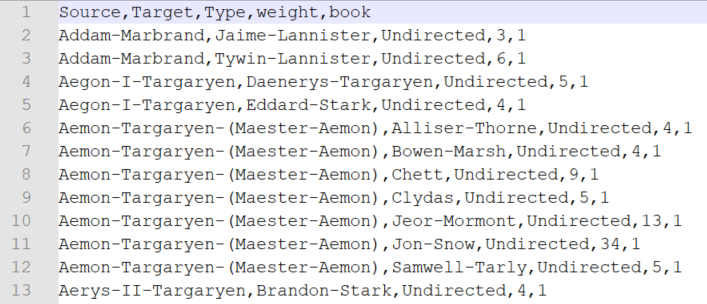

#### gexf

A WebAtlas study for the European Science in Society program ([WebAtlas_EuroSiS.gexf](./data/WebAtlas_EuroSiS.gexf)).

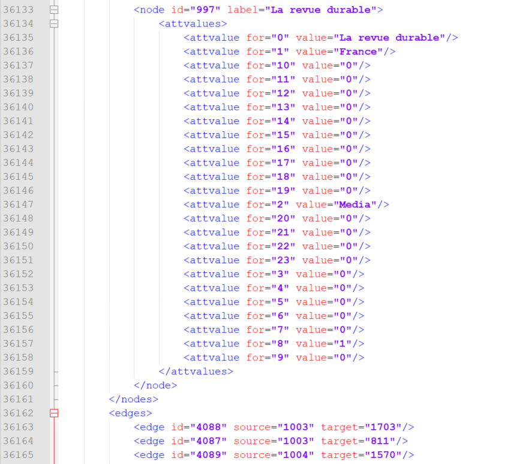

## Gephi

**Gephi** is a free open source program for visualising network. You can download the latest version [from the official website](https://gephi.org/), where you will also find [a user guide](https://gephi.org/users/). With Gephi, you can create very beautiful and informative visualisations. Here is an example from the work of Polish stylometry expert Jan Rybicki: a chronology of Charles Dickens' novels, built using the most frequent words in the text.

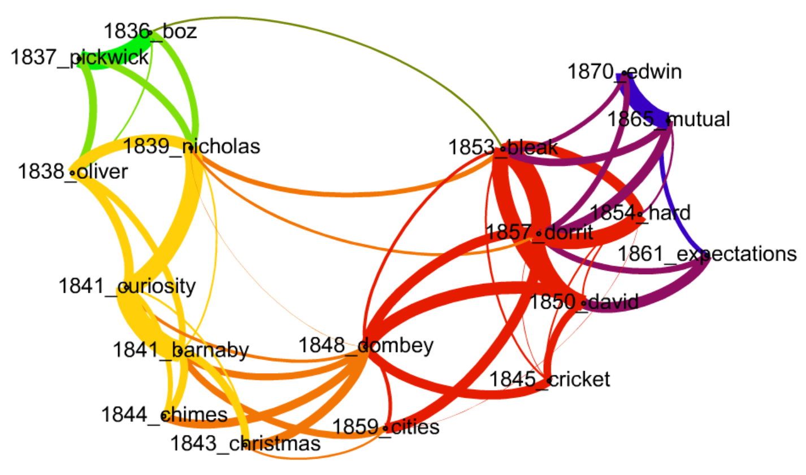

Graphs created in Gephi can not only be saved as images or PDFs but also published online (for example, on GitHub) using the Sigma plugin.  Here is [an example of an interactive graph](https://yosej.github.io/Ossian_Full_Network/) based on the Ossian cycle of epic poems by James Macpherson.

Now, let's take a look at how to do all of this. For this workshop, we will be working with co-occurrence network of the characters in the first book of the _Game of Thrones_ series, which you can download [here](./data/GoT_Book1.csv). Feel free to use your own data or any other dataset available in the `data` folder in this repository or from external resources.  Below are a few websites and repositories where you can find more interesting graph data to explore and practice:

* [Network Data Repository](https://networkrepository.com/)
* [Stanford Large Network Dataset Collection](https://snap.stanford.edu/data/)
* [Colorado Index of Complex Networks](https://icon.colorado.edu/networks)
* [University of Michigan](http://www-personal.umich.edu/~mejn/netdata/)
* [Network Corpus](https://github.com/microgravitas/network-corpus)

### Getting started

When the program is launched, a welcome window appears where you need to select "Open graph file." 
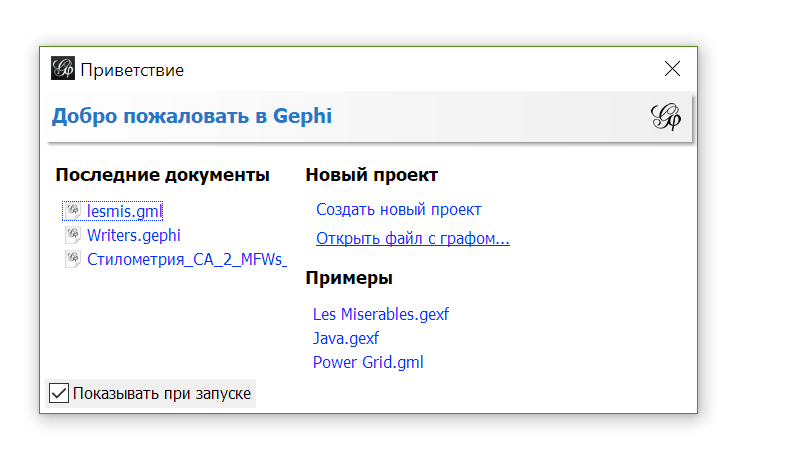

After importing, Gephi will display a report with the graph's characteristics, as well as the number of nodes and edges.

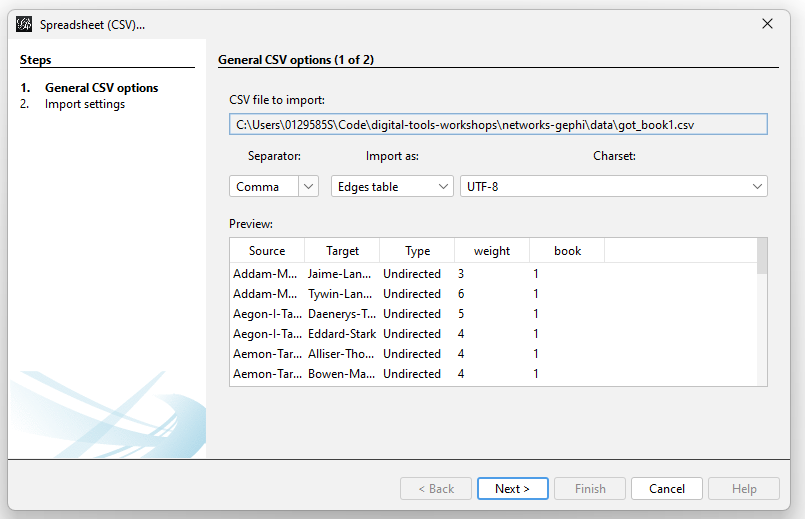

Immediately after loading, the graph will look like this.

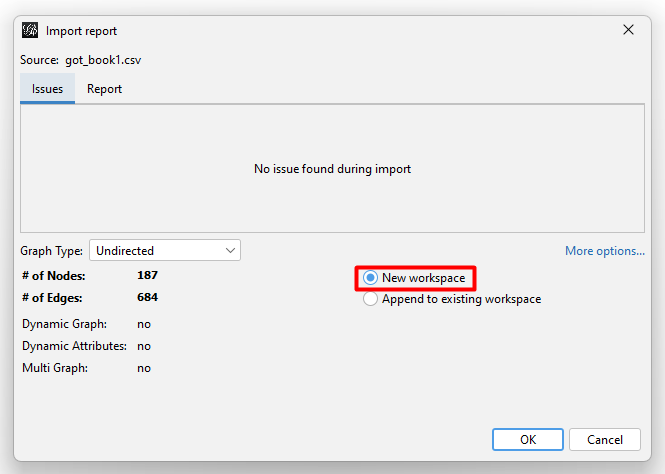

To make the graph more visually informative, you can adjust the colour and the size of the nodes and edges according to their attributes. Let's start by calculating the modularity to divide the graph into communities. This can be done in the "Statistics" tab on the workspace panel on the right.

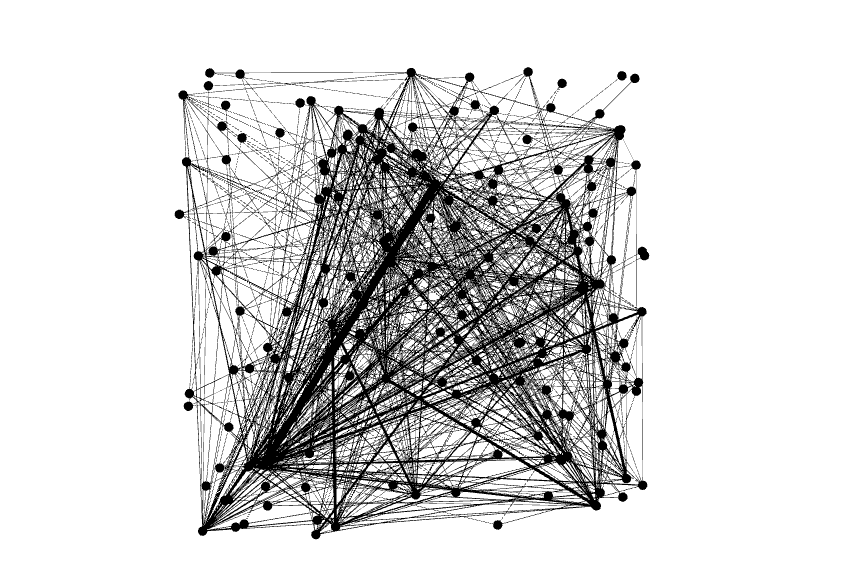

Now let's move on to changing the colour of the nodes and edges. This is done using the palette icon in the "Appearance" tab on the left workspace panel. By default, all nodes and edges are coloured in one colour (Unique), but we will colour them according to the communities they belong to (Partition > Modularity Class). You can also choose any other attribute, such as gender or city (Partition > Gender/City), or colour the nodes according to their degree (Ranking > Degree).

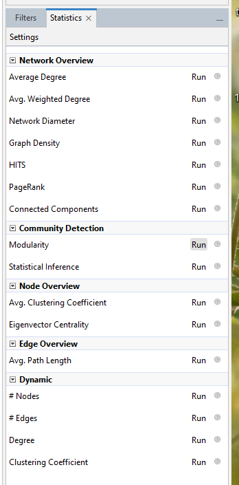

In the bottom-right corner, you will see a small label "Palette." By clicking on it, you can choose the colours that the nodes will be coloured in. Default palettes have only 8 colours, but for such a large graph, you'll clearly need more. For such cases, Gephi provides the option to generate a palette: to have as many colours as there are different values for the selected attribute, simply uncheck "Limit number of colours," then click Generate and OK. I want to colour the nodes according to their community, and there are 40 communities in my graph (remember, we calculated the modularity?), so I will generate a palette with 40 colours. You can also choose the style of the palette (under the Presets parameter): pastel tones, dark colours, vivid colours, etc.

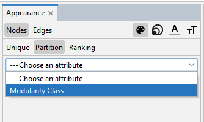

Now you can adjust the node sizes — by default, they are all the same. To do this, click on the icon with circles (to the right of the palette) in the "Appearance" tab on the left panel. Here, you can also adjust the thickness of the edges — just switch from the "Nodes" tab to the "Edges" tab. The remaining two icons control the colour and size of the labels.

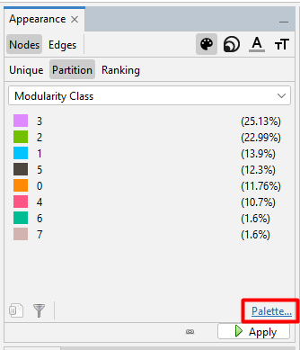

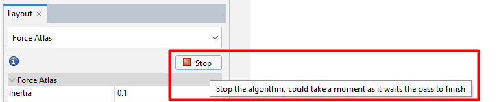

After these adjustments, you should get a visualisation similar to this. You can zoom in and out using the mouse wheel (unfortunately, this might not work well with a touchpad). The magnifying glass button at the bottom of the toolbar to the left of the workspace centers the graph.

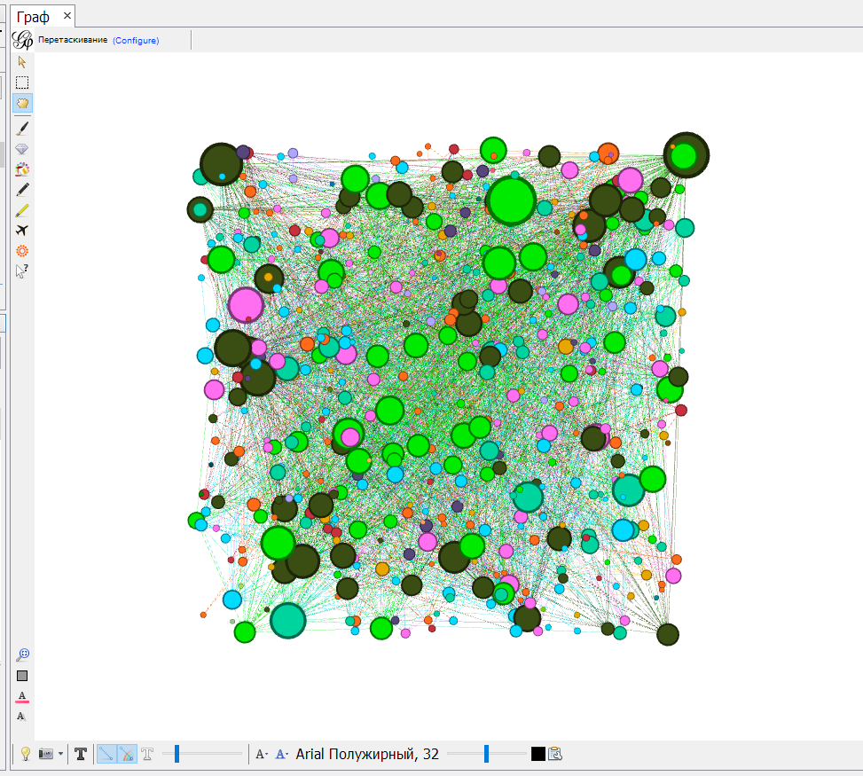

By default, the graph layout is random—meaning the position of nodes and their proximity to each other do not convey any meaning. Let's make the visualization more meaningful using a layout algorithm. The Layout menu is located in the bottom left corner. For example, the Fruchterman-Reingold algorithm arranges nodes in a circular pattern. Notice how nodes of the same colour, belonging to the same community, are naturally drawn closer together.

Here’s another useful algorithm: Force Atlas. By the way, you don’t have to wait for the layout process to finish completely (spoiler: [it can run indefinitely](https://www.dropbox.com/s/ek84sjxsanm1rda/force_layout.mp4?dl=0)). If you're happy with the result, you can simply press "Stop".

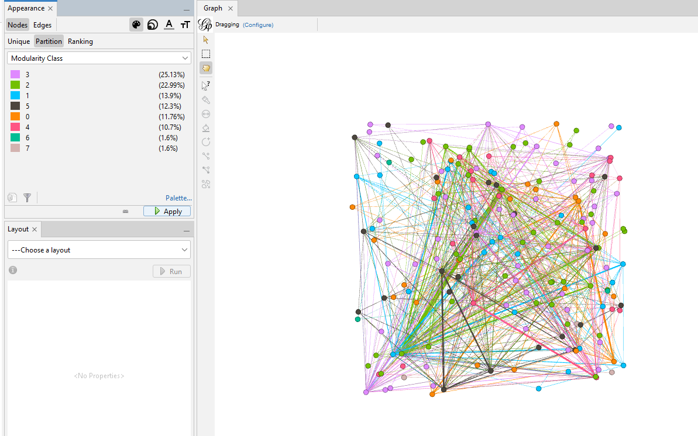

If you feel that the nodes are too close together, you can use the "Expand" function.

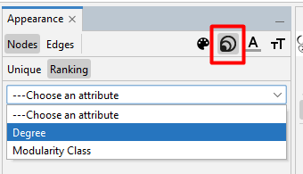

The image has become more representative, but it clearly lacks node labels (they are called **labels**). There is a toolbar below the graph area for working with them. To make the labels appear, click on the black letter **T**; to the right, you can select the colour, font, and size.

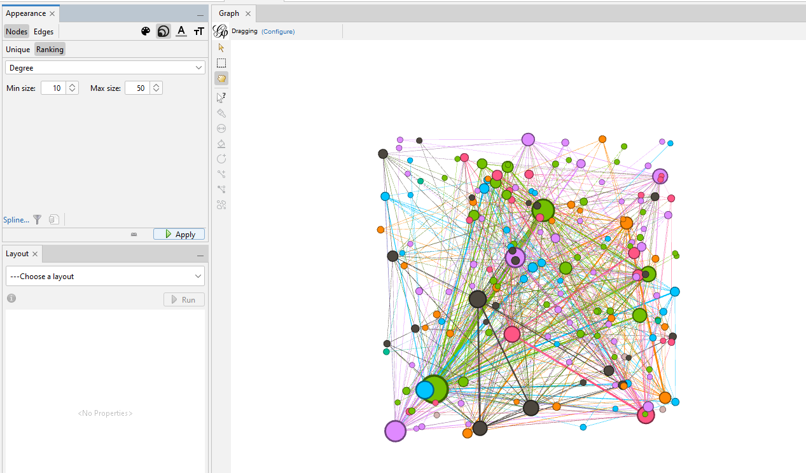

After enabling labels, you will likely notice that they overlap. To avoid this, you need to run the Label Layout algorithm. The images below show the graph before and after applying the layout.

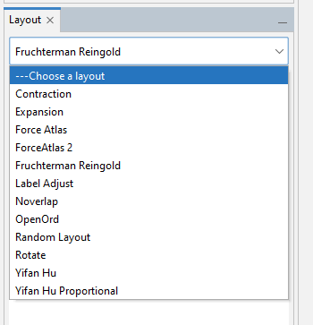

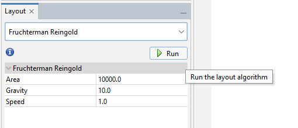

These are not all the tools available in Gephi, but this concludes our modifications to the graph's appearance. **NB!** Gephi does not have an "Undo" button (yes, that happens!), so be careful with changes to avoid having to redo everything from scratch.

So far, we have been working in the "Overview" tab. The next tab, "Data Laboratory," allows you to view the data in a table format, add or remove columns and rows, edit or filter them using regular expressions, and export data to CSV (or import from CSV, which is very convenient).

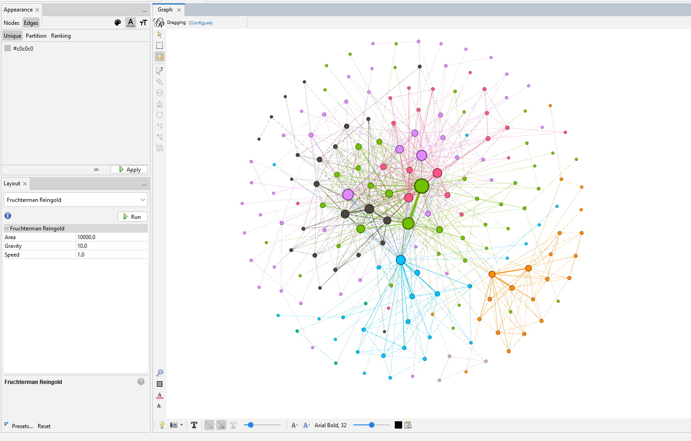

Finally, in the last tab, "Preview," you can see a nicely rendered version of the graph instead of the working version. The only thing to keep in mind is that you will need to enable the labels again, but this time using the toolbar on the left within this tab.

If you're working with a large graph, it's best to uncheck the "Proportional size" option and slightly increase the font size. The rest of the label settings can be adjusted to your preference.

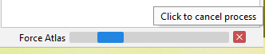

Most likely, at first, you will just see a blank white field without the graph. To render it, you need to click the "Refresh" button at the bottom. The same applies after any changes—if you want to see the updates, you must click "Refresh" again.

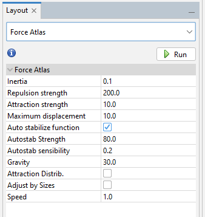

The final result is quite easy to interpret.
If you use the Force Atlas layout, you can more clearly see the nodes that are closely connected to several communities.

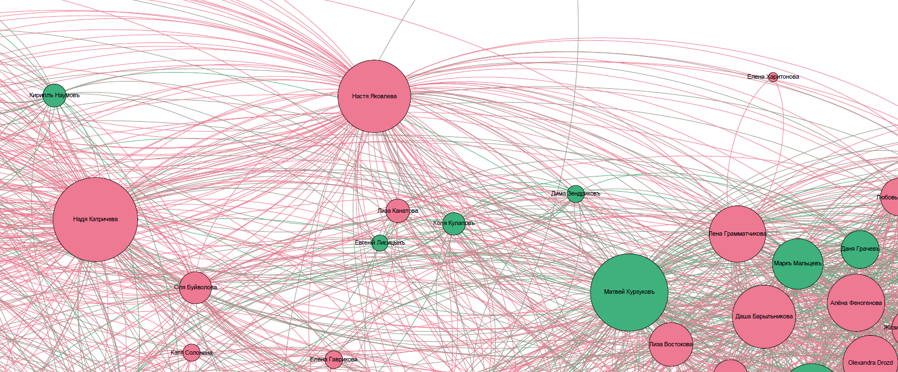

### Exporting a graph
The graph can be saved as a PNG or PDF. If you need a small file and detail is not important, it's better to choose PNG. However, if you want to examine the graph at any zoom level without losing quality, it's better to choose PDF. The graph can be exported in two ways: using the corresponding button in the bottom left corner of the "View" tab or via the "File > Export" menu.

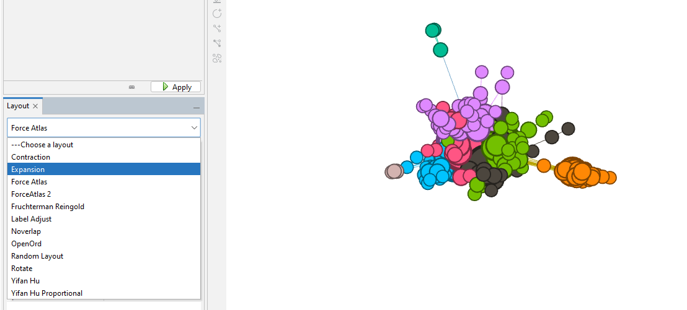

Additionally, you can export not just a static image, but a dynamic graph and upload it to the internet — just like the Macpherson poems study, remember? To do this, you need to install the Sigma Exporter plugin from the "Tools > Plugins > Available Plugins" menu and then restart Gephi. Don't forget to save your project ("File > Save Project" or Ctrl + S) before restarting, to avoid losing your work!

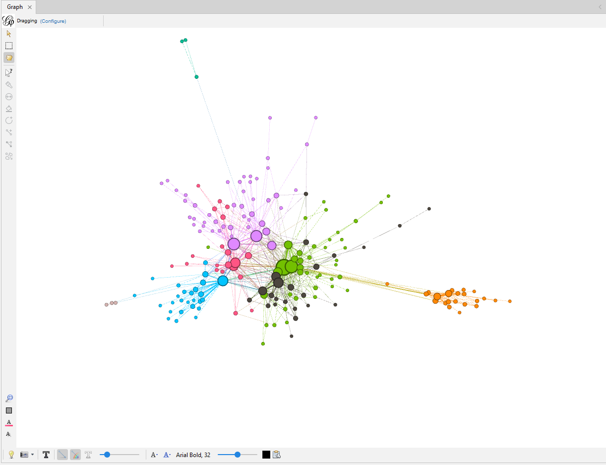

After that, you can save the graph in Sigma by selecting "File > Export > Sigma.js template".

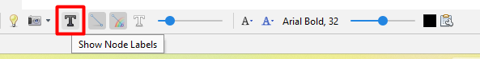

In the window that appears, you need to specify the folder path where you want to export the project, as well as the details for the legend: the title and a brief description of the graph, as well as what the nodes, edges, and their colours represent.

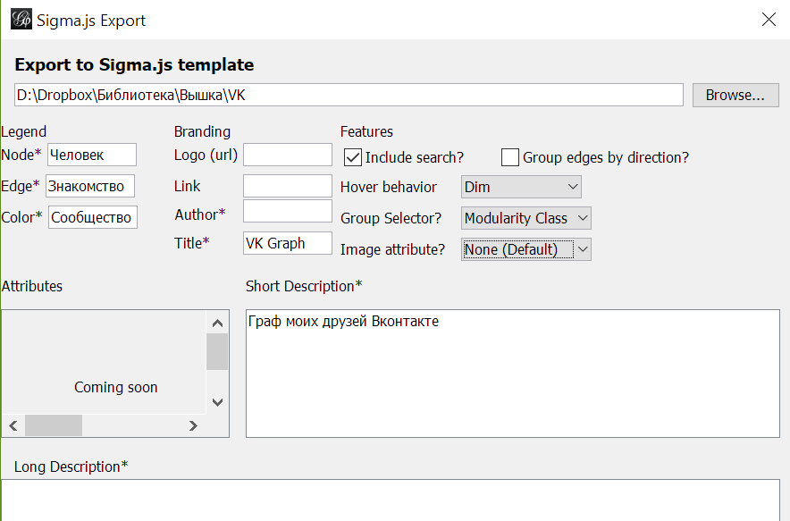

After this, a folder named "network" will appear in the specified directory. All the files from this folder need to be uploaded to a new repository on GitHub. If you forgot to include something during the export, you can manually edit the `config.json` file by opening it in a text editor. Here is a list of the files that should be in your repository.

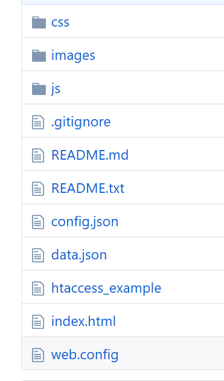

Now that all the necessary files are in the repository, go to its settings and scroll down to the "GitHub Pages" section. Then, in the "Source" dropdown, select the "Master branch" and click the "Save" button. A green notification should appear with the address of your page in the format: [https://username.github.io/repository\_name](https://username.github.io/repository_name)

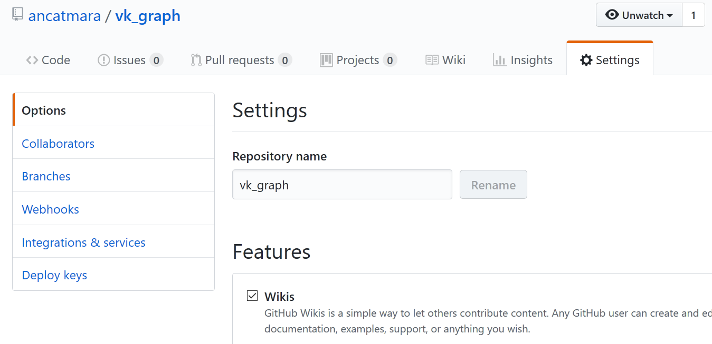

It should look something like this. If you want, you can experiment with the `index.html file` to remove elements you don't like (for example, the empty space at the top of the legend).

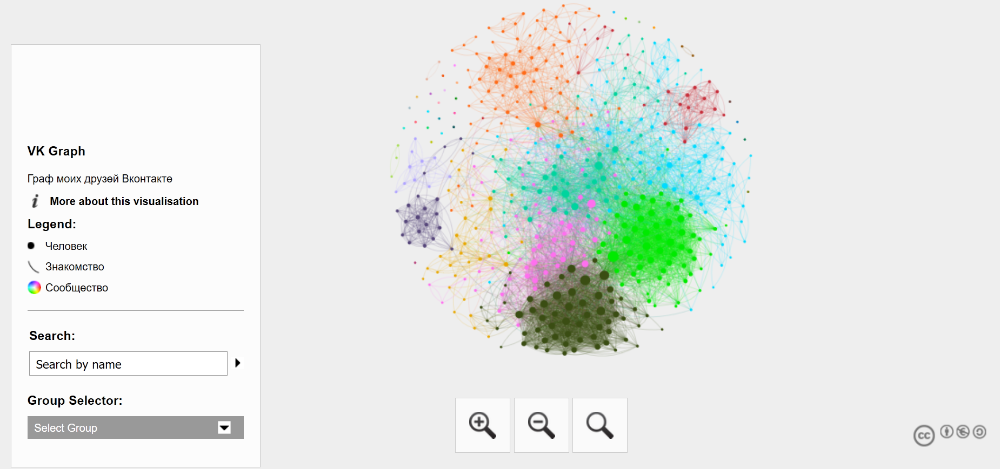
Please note that all selectors should be functional!

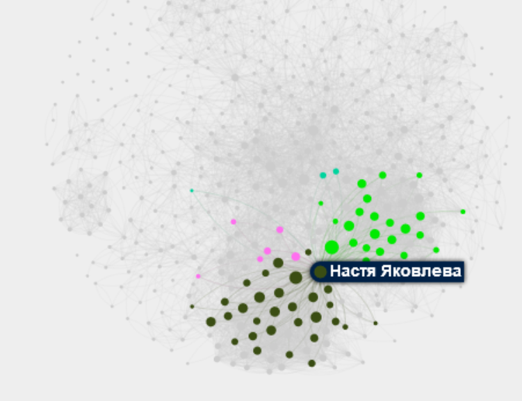

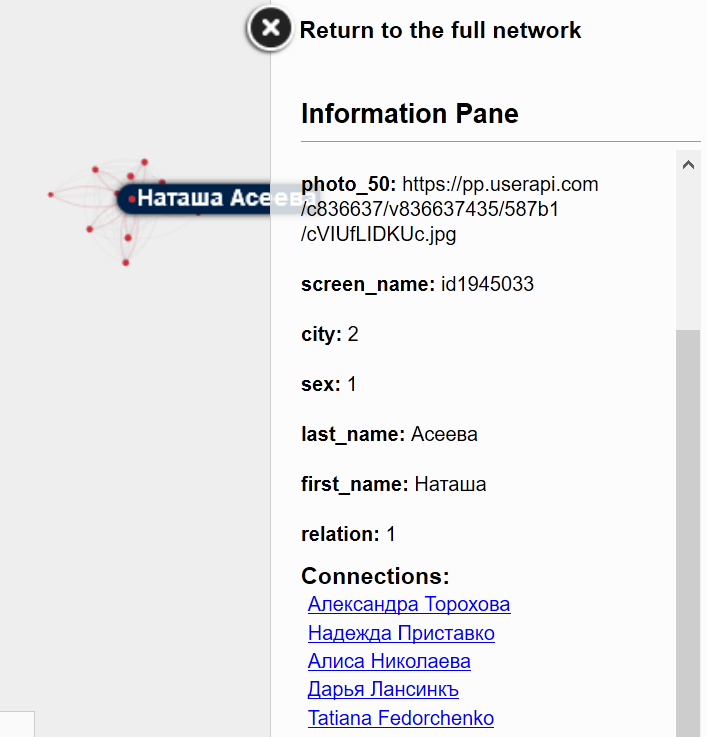

