# Network Analysis with Gephi

### What is a graph?

A **graph, or network** is a data model consisting of **nodes (vertices)** and the connections between them, also called **edges (links, arcs)**. Networks provide clear and intuitive visual representations of relationships, where nodes typically represent individual entities (such as people, organizations, or objects), and edges signify the connections or interactions between them. These networks appear in various contexts, including social, technological, and biological systems.

For example, this is what the internet looks like, represented as a graph of IP addresses.

_Image source: Wikimedia_

### What types of graphs are there?

Graphs can be described in the following terms:

* **directed** and **undirected** (connections as arrows vs connections as lines)
* **connected** and **disconnected** (all nodes are connected vs some nodes are isolated from the main graph)
* **weighted** and **unweighted** (connections have numerical values vs they do not)
* **complete** (every node is connected to every other node, but there are no self-loops)
* **bipartite** (there are two subsets of nodes, and every edge connects a node from subset A to a node from subset B)

For example, looking at the London Underground, stations can be viewed as nodes, and tracks connecting them serve as edges. When calculating travel time, you are working with a weighted graph, where each track segment between two stations is assigned a time value in minutes.

_Image source: [Transport for London](https://tfl.gov.uk/)_

### Communities

Nodes in graphs can be grouped into communities. A **community** is a dense subgraph where all (or almost all) nodes are interconnected. 

_Image source: [TDS Archive](https://medium.com/data-science/community-detection-algorithms-9bd8951e7dae)_

### Social network analysis

**Social network analysis (SNA)**, or simply **network analysis (NA)**, is a research method used to understand and visualise how networks function, and to identify the most important nodes within them. It involves analysing the connections between entities, as well as the characteristics of the entities themselves.

_Image source: [VisibleNetworksLabs](https://visiblenetworklabs.com/guides/social-network-analysis-101/)_

### Graph metrics

A **metric** is a quantifiable measure used to describe and compare models, processes and performance, e.g. _customer retention rate_ or _the number of users visiting your website_. When comparing multiple items, the outcome of the comparison will depend on the metric used. For example, when comparing the research output of different academics, using the _number of publications_ as a metric would rank the researcher with the most articles published as the highest. However, if you use _citation count_ as a metric, the researcher whose work is most frequently cited, even if they have fewer publications, may be considered more influential. 

In graph theory and network analysis, the following metrics are commonly used.

**Degree** is the number of connections a node has.

**Weighted degree** is the number of connections of a node divided by the total number of connections in the graph.

There is a number of ways to measure the importance of a node.

* **Degree centrality**:  the more connections a node has, the more important it is (A).
* **Closeness centrality**: the more central a node is (i.e., the shorter the path from it to all other nodes), the more important it is (B).
* **Betweenness centrality**: the more often a node connects two other nodes, the more important it is (C).
* **Eigencentrality**: "the more friends your friends have, the more important you are" (D).

_Image source: Claudio Rocchini / Wikimedia._

**Assortativity coefficient** determines with whom the "important" nodes are connected: if they are connected with other "important" nodes, the coefficient value is high, otherwise, it is low.

**Clustering coefficient** is the degree of interaction between a node's immediate neighbors, i.e., the probability that the node's closest neighbors are not only connected to it but also to each other.

**Density** is the ratio of the number of edges to the maximum possible number of edges. Communities tend to have a high clustering coefficient and high density.

**Modularity** measures how much denser the connections within a group are compared to the connections between groups. This metric is used to partition the graph into communities.

### Graph formats

Graphs are usually stored in text files (`.gml`, `.csv`) or in XML files (`.graphml`, `.gexf`), where all the nodes, edges, and their attributes – for example, the name of a node or the weight of an edge – are listed. This is what `.gml`, `.gexf` and `.csv` files look like, respectively.

#### gml

A coappearance network of characters in the novel _Les Misérables_ by Victor Hugo ([lesmis.gml](./data/lesmis.gml)).

#### gexf

The same graph in GEXF format ([lesmis.gexf](./data/lesmis.gexf)).

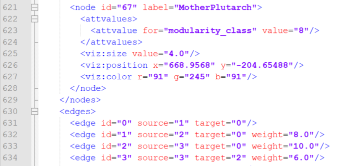

#### csv

A co-occurrence network of the characters in the _Game of Thrones_ ([./game_of_thrones/book1.csv](./data/game_of_thrones/book1.csv)).

## Gephi

**Gephi** is a free open-source program for visualising networks. You can download the latest version [from the official website](https://gephi.org/), where you will also find [a user guide](https://gephi.org/users/). With Gephi, you can create very beautiful and informative visualisations for your research — here are a few examples.

[A chronology of Charles Dickens' novels](https://dhd2016.de/abstracts/EADH_01.html) built using the most frequent words in the text by Dr. Jan Rybicki.

[A network of thematic connections in artworks from the Smithsonian American Art Museum, made between 1900 and 1935](https://matthewlincoln.net/2013/11/12/networks-of-the-smithsonian-american-art-museum.html), by Dr. Matthew Lincoln.

[An air transportation network](https://www.martingrandjean.ch/connected-world-air-traffic-network/) based on [openflights.org](https://openflights.org/) data, where nodes represent airports, node sizes reflect the number of routes and colours roughly represent continents, by Dr. Martin Grandjean.

Graphs created in Gephi can also published online (for example, on GitHub) using the Sigma plugin. Here is [an example of an interactive graph](https://yosej.github.io/Ossian_Full_Network/), created by Dr. Joseph Yose, based on the Ossian cycle of epic poems by James Macpherson.

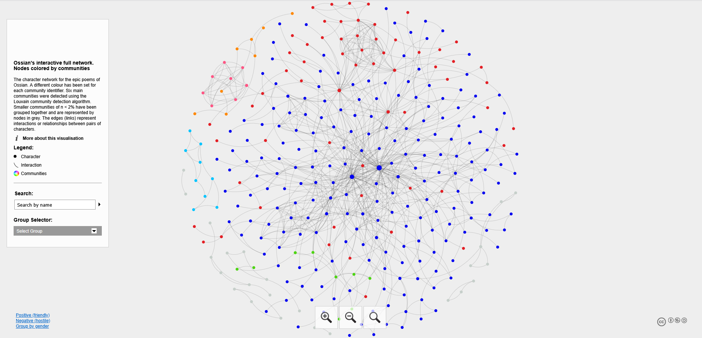

### Data

Now, let's take a look at how to do all of this. For this workshop, we will be working with co-occurrence network of the characters in the first book of the _Game of Thrones_ series, which you can download [from this repository](./data/game_of_thrones) or [from Kaggle](https://www.kaggle.com/datasets/mmmarchetti/game-of-thrones-dataset). Feel free to use your own data or any other dataset available in the `data` folder in this repository or from external resources.  Below are a few websites and repositories where you can find more interesting graph data to explore and practice:

* [Network Data Repository](https://networkrepository.com/)
* [Stanford Large Network Dataset Collection](https://snap.stanford.edu/data/)
* [Colorado Index of Complex Networks](https://icon.colorado.edu/networks)
* [University of Michigan](http://www-personal.umich.edu/~mejn/netdata/)
* [Network Corpus](https://github.com/microgravitas/network-corpus)

### Getting started

When the program is launched, a welcome window appears where you need to select "Open graph file." 
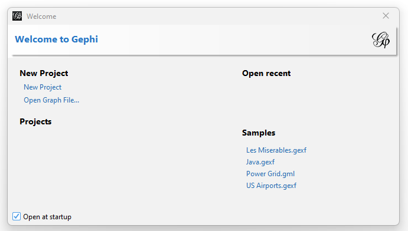

After importing, Gephi will display a report with the graph's characteristics, as well as the number of nodes and edges.

**NB! Gephi does not have an "Undo" button**, so be careful with changes to avoid having to redo everything from scratch!

### `Overview` tab

Immediately after loading, the graph will open in the "Overview" tab. It will look like this.

### `Data Laboratory` tab

Before working with the graph, we may need to make some adjustments. This can be done in the "Data Laboratory" tab, which is designed for manipulating source data. For example:

* adding nodes and edges manually adding, deleting and merging columns;
* creating new columns based on regular expressions;
* editing text and numbers in the cells;
* importing and exporting data as a spreadsheet.

When we imported the Game of Thrones dataset from `csv`, the first column containing character names was interpreted as the ID, but there was no separate "Label" column, which we will need later to display node labels. To create it, we will duplicate the contents of the ID column into a new column called "Label" in the "Data Laboratory" tab. Additionally, you can replace all dashes with spaces in the "Label" column for better readability.

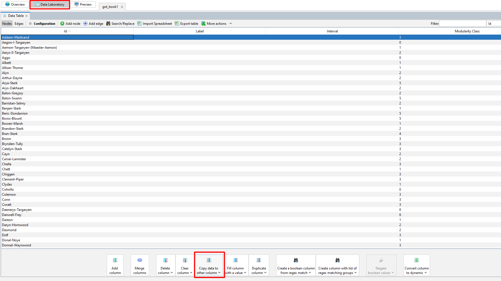

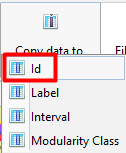 &nbsp;&nbsp;&nbsp;&nbsp;
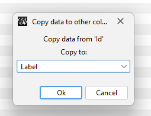

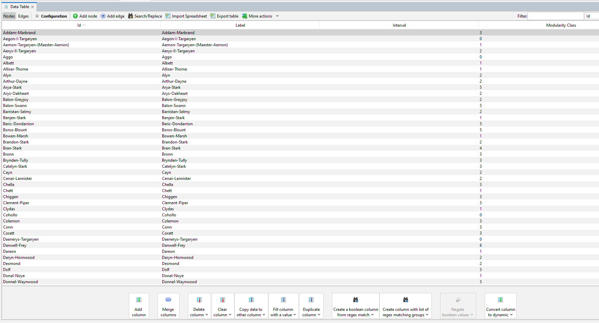

### Adjusting node size and colour

Now, let's go back to the "Overview" tab. To make the graph more visually informative, you can adjust the colour and the size of the nodes and edges according to their attributes. Let's start by calculating the modularity to divide the graph into communities. This can be done in the "Statistics" tab on the workspace panel on the right.

Now let's move on to changing the colour of the nodes and edges. This is done using the palette icon in the "Appearance" tab on the left workspace panel. By default, all nodes and edges are coloured in one colour (Unique), but we will colour them according to the communities they belong to (Partition > Modularity Class). You can also choose any other attribute you have in your data, or colour the nodes according to their degree (Ranking > Degree).

After changing the colours, your graph will look like this.

In the bottom-right corner, you will see a small label "Palette." By clicking on it, you can choose the colours that the nodes will be coloured in. Default palettes have only 8 colours, but if you have a larger graph, you may want more colours. For such cases, Gephi provides the option to generate a palette: to have as many colours as there are different values for the selected attribute, simply uncheck "Limit number of colours," then click "Generate" and "OK". You can also choose the style of the palette (under the Presets parameter): pastel tones, dark colours, vivid colours, etc.

 &nbsp;&nbsp;&nbsp;&nbsp;

Now you can adjust the node sizes — by default, they are all the same. To do this, click on the icon with circles (to the right of the palette) in the "Appearance" window on the left panel. The remaining two icons control the colour and size of the labels.

After these adjustments, you should get a visualisation similar to this. You can zoom in and out using the mouse wheel. The magnifying glass button at the bottom of the toolbar to the left of the workspace centers the graph.

### Layout

By default, the graph layout is random, i.e. the position of nodes and their proximity to each other do not convey any meaning. Let's make the visualization more meaningful using a layout algorithm. The "Layout" menu is located in the bottom left corner. Here is a summary of some of the layout algorithms available in Gephi 0.10 (you can download the [official tutorial in PDF](https://gephi.org/tutorials/gephi-tutorial-layouts.pdf) for a more detailed explanation).

1. **Contraction**: brings nodes closer together
2. **Expansion**: the opposite of contraction, increases space between nodes
3. **ForceAtlas**: a force-directed algorithm, ideal for most small world/scale-free networks
4. **ForceAtlas 2**: an improved version of ForceAtlas, offering faster performance and better scalability.
5. **Fruchterman-Reingold**: another force-directed layout that distributes nodes in a way that minimizes edge crossings; works with undirected graphs
6. **Label Adjust**: stops labels from overlapping each other
7. **Noverlap**: stops nodes from overlapping each other
8. **OpenOrd**: a layout similar to Fruchterman-Reingold that emphasizes community structures (clusters) within the network; works with undirected graphs
9. **Random Layout**: randomises the position of nodes
10. **Rotate**: rotates the graph bu 90 clockwise
11. **YifanHu**: a fast algorithm that’s particularly useful for large networks; combines a force-directed model with a graph coarsening technique (multilevel algorithm) to reduce the complexity
12. **YifanHu Proportional**: similar to YifanHu, but node sizes are proportional to a specific metric or attribute value
13. ***Circular Layout**: orders the nodes by any metric or attribute and positions them in a circle; useful for emphasizing cyclic structures
14. ***Geographic Map**: if your nodes have geographical attributes, this layout positions them based on their real-world locations

*You have to install plugins from `Tools > Plugins > Available Plugins` to use these layout algorithms.

Let's run the Fruchterman-Reingold algorithm and observe how nodes of the same colour, belonging to the same community, are being drawn closer together.

&nbsp;&nbsp;&nbsp;&nbsp;

By the way, you don’t have to wait for the layout process to finish: if you're happy with the result, you can simply press "Stop" for algorithms that don't stop automatically, like Force Atlas, or cancel the process for others, like Fruchterman-Reingold. Otherwise, [they can run indefinitely](https://www.dropbox.com/scl/fi/3zoo9hvigtqiut8mi68gb/force_layout.mp4?rlkey=rh5hhxxlruunowc52mzueinjd&st=6doi3e5h&dl=0).

If you feel that the nodes are too close together, you can use the "Expansion".

### Labels

The image has become more representative, but it clearly lacks node **labels**. There is a toolbar below the graph area for working with them. To make the labels appear, click on the black letter **T**; to the right, you can select the colour, font, and size.

Now, if we go back to "Overview", the graph will look like that.

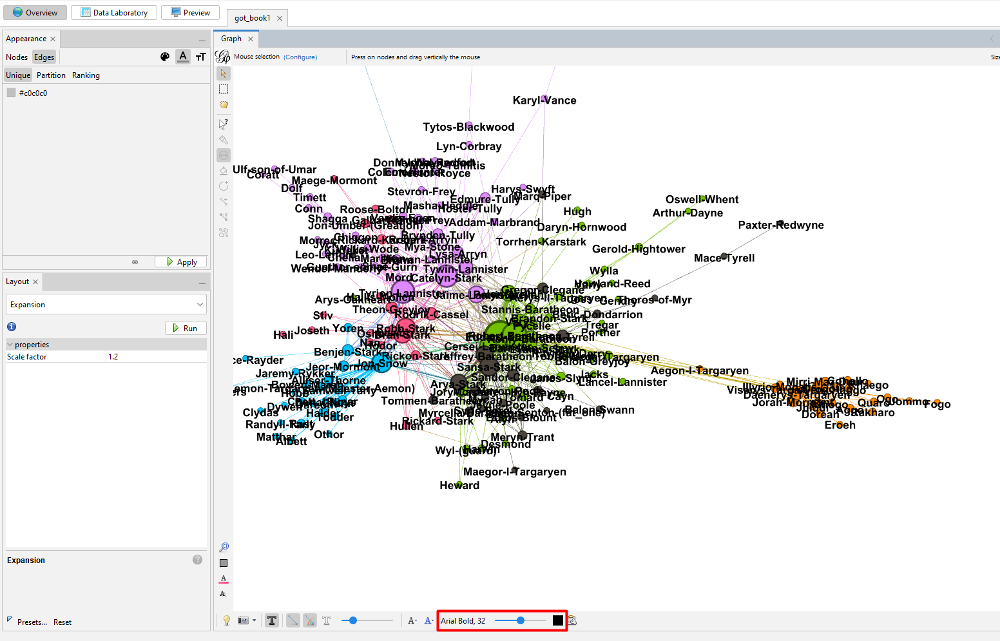

After enabling labels, you will likely notice that they overlap. To avoid this, you need to run the "Label Adjust" algorithm in the "Layout" window. The images below show the graph before and after applying the layout.

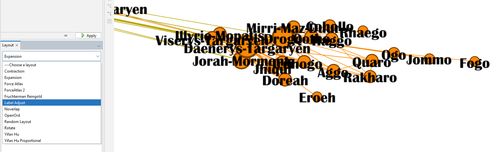

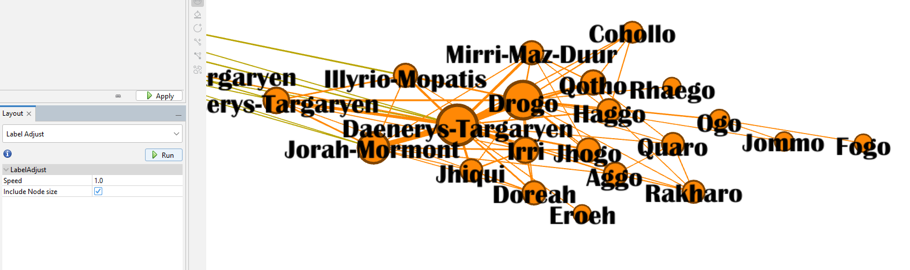

### `Preview` tab

Finally, in the last tab, "Preview," you can see a nicely rendered version of the graph instead of the working version. The only thing to keep in mind is that you will need to enable the labels again, but this time using the toolbar on the left within this tab.

If you're working with a large graph, it's best to uncheck the "Proportional size" option and slightly increase the font size. The rest of the label settings can be adjusted to your preference.

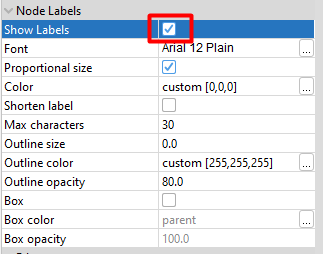

Most likely, at first, you will just see a blank white field without the graph. To render it, you need to click the "Refresh" button at the bottom. The same applies after any changes—if you want to see the updates, you must click "Refresh" again.

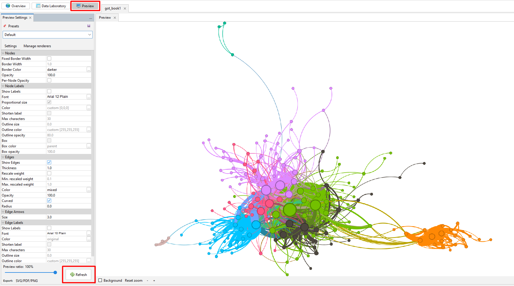

### Exporting a graph

#### Static
The graph can be saved as a PNG, SVG or PDF. If you need a small file and detail is not important, it's better to choose PNG. However, if you want to examine the graph at any zoom level without losing quality, it's better to choose PDF or SVG. The graph can be exported in two ways: using the corresponding button in the bottom left corner of the "View" tab or via the "File > Export" menu.

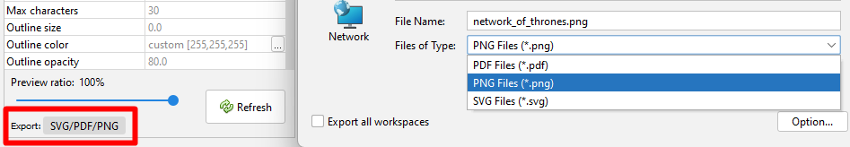

#### Dynamic 
Additionally, you can export a dynamic graph and upload it online. To do this, you need to install the Sigma Exporter plugin from the "Tools > Plugins > Available Plugins" menu and then restart Gephi. Don't forget to save your project ("File > Save Project" or Ctrl + S) before restarting, to avoid losing your work!

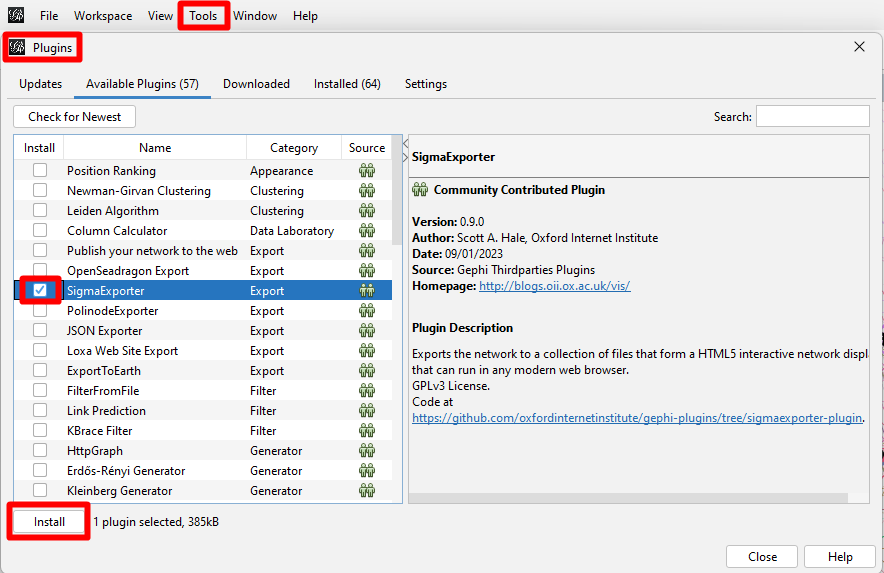

After that, you can save the graph in Sigma by selecting "File > Export > Sigma.js template".

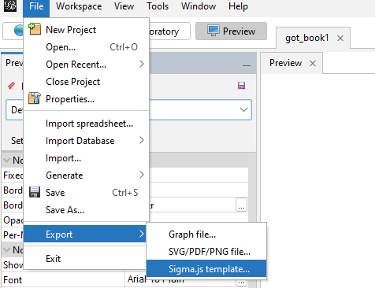

In the window that appears, you need to specify the folder path where you want to export the project, as well as the details for the legend: the title and a brief description of the graph, as well as what the nodes, edges, and their colours represent.

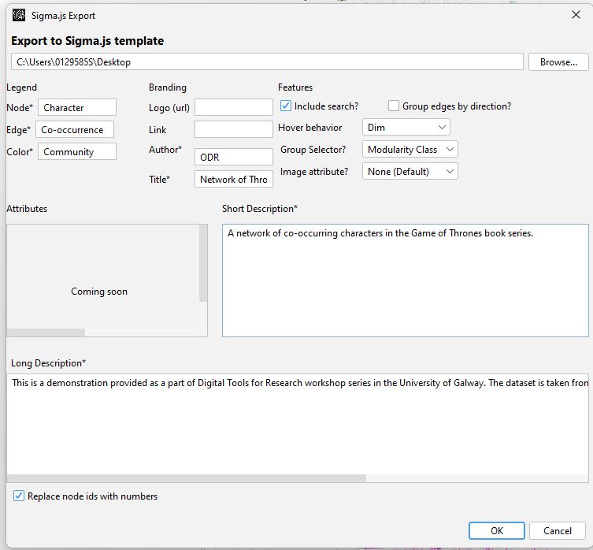

After this, a folder named "network" will appear in the specified directory. All the files from this folder need to be uploaded to a new repository on GitHub. If you forgot to include something during the export, you can manually edit the `config.json` file by opening it in a text editor. Here is a list of the files that should be in your repository.

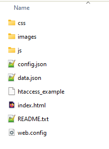

Now that all the necessary files are in the repository, go to its settings and scroll down to the "GitHub Pages" section. Then, in the "Source" dropdown, select the "Master branch" and click the "Save" button. When you refresh the page, you will see the link to your interactive visualisation.

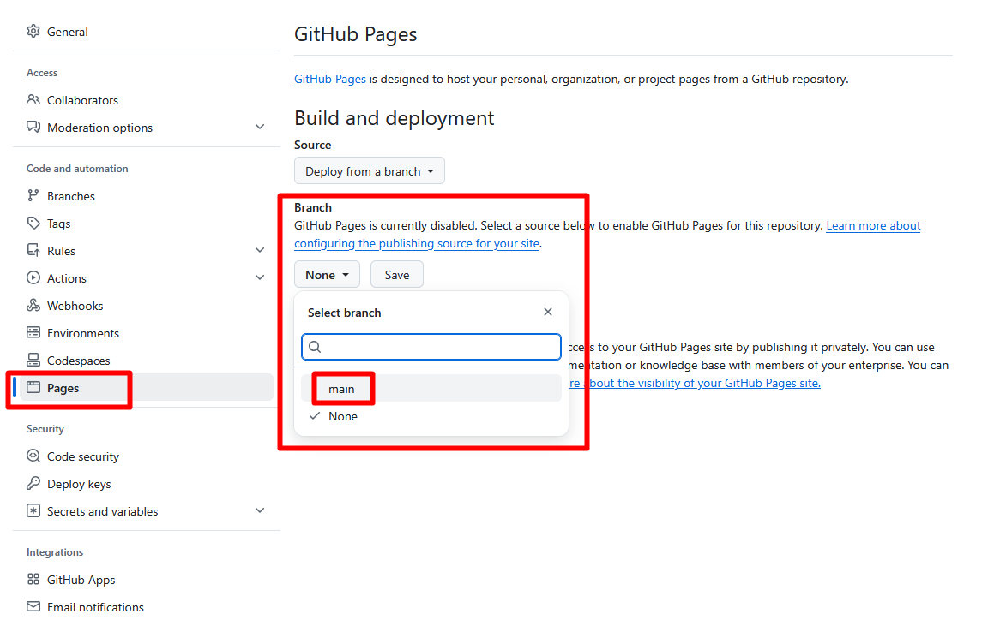

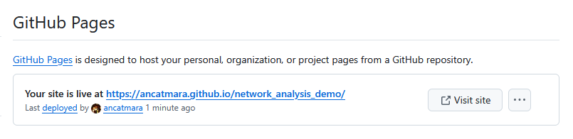

It should look something like this. If you want, you can experiment with the `index.html file` to remove elements you don't like (for example, the empty space at the top of the legend).

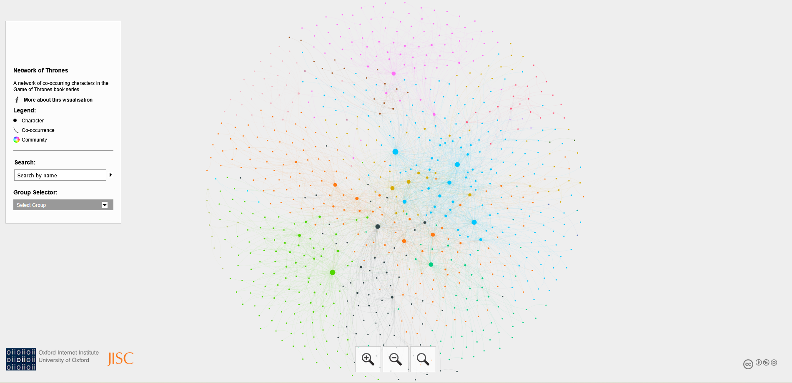

Please note that all selectors should be functional!

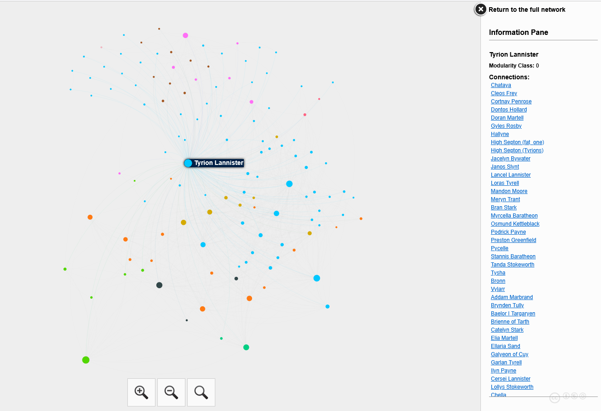

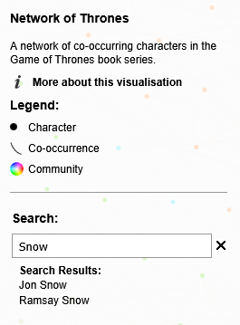

## Further reading

1. Martin Grandjean. (2021). [Introduction to Social Network Analysis: Basics and Historical Specificities.](https://www.martingrandjean.ch/introduction-to-social-network-analysis/) [video & pdf]
2. Andrew Beveridge. (2020). [Network of Thrones. A Song of Maths and Westeros.](https://networkofthrones.com/)
3. [Gephi Documentation](https://docs.gephi.org/)
4. [Gephi tutorials](https://gephi.org/users/) (official & created by users)
5. Billy Mosse. (2020). [A quick tutorial on Gephi layouts — using a Q&A StackOverflow dataset.](https://medium.com/data-science/a-quick-tutorial-on-gephi-layouts-daa87fec5a20) Medium.
6. Brown University Libraries. [Network Analysis with Gephi](https://libguides.brown.edu/gephi)
8. Christine Egan. (2023). [Social Network Analysis and Visualization with Python.](https://christineegan42.medium.com/social-network-analysis-and-visualization-with-python-b7769a417aff) Medium.
9. Mohammed Saqr, Sonsoles López-Pernas, Miguel Ángel Conde-González & Ángel Hernández-García. (2024). [Social Network Analysis: A Primer, a Guide and a Tutorial in R.](https://link.springer.com/chapter/10.1007/978-3-031-54464-4_15) In: Saqr, M., López-Pernas, S. (eds) Learning Analytics Methods and Tutorials. Springer, Cham. https://doi.org/10.1007/978-3-031-54464-4_15
