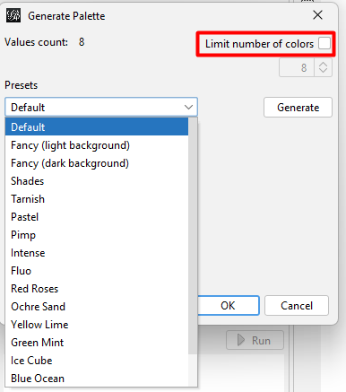

# Network Analysis with Gephi

### What is a graph?

A **graph, or network** is a data model consisting of **nodes (vertices)** and the connections between them, also called **edges (links, arcs)**. Networks provide clear and intuitive visual representations of relationships, where nodes typically represent individual entities (such as people, organizations, or objects), and edges signify the connections or interactions between them. These networks appear in various contexts, including social, technological, and biological systems.

And this is what the internet looks like!

_Image source: Wikimedia_

### What types of graphs are there?

Graphs can be described in the following terms:

* **directed** and **undirected** (connections as arrows vs connections as lines)
* **connected** and **disconnected** (all nodes are connected vs some nodes are isolated from the main graph)
* **weighted** and **unweighted** (connections have numerical values vs they do not)

For example, if you look at the London Underground, the stations can be considered nodes, and the tracks connecting them serve as edges. When calculating travel time, you are working with a weighted graph, where each track segment between two stations is assigned a time value in minutes.

_Image source: [Transport for London](https://tfl.gov.uk/)_

### Social network analysis

Social network analysis (SNA), or simply network analysis (NA), is a research method used to understand and visualise how networks function, and to identify the most important nodes within them. It involves analysing the connections between entities, as well as the characteristics of the entities themselves.

_Image source: [VisibleNetworksLabs](https://visiblenetworklabs.com/guides/social-network-analysis-101/)_

### Communities

Nodes in graphs can be grouped into communities. A **community** is a dense subgraph where all (or almost all) nodes are interconnected. 

_Image source: [TDS Archive](https://medium.com/data-science/community-detection-algorithms-9bd8951e7dae)_

### Метрики

**Метрика** -- это результат измерений, проведенных определенным способом. Представьте, что вы выбираете материал для реферата на тему "Слово о полку Игореве": у вас есть оригинальный текст в 50 страниц, современная книга А.А. Зализняка "Слово о полку Игореве: взгляд лингвиста" в 500 страниц и англоязычная статья "The Igor Tales and Their Folkloric Background" в 100 страниц. Если метрикой для вас является количество страниц, то вы выберете оригинальный текст, а если простота чтения -- то современную русскоязычную книжку.

**Степень, или мощность узла** _\(degree\)_ -- это количество его связей.

**Взвешенная степень** _\(weighed degree\)_ - - это количество связей узла, разделенное на общее количество связей в графе.

Важность узла можно определять разными способами:

* **degree centrality**: у кого больше связей, тот и важнее
* **closeness centrality**: чем центральнее узел \(т.е. чем короче путь от него до всех остальных узлов\), тем он важнее
* **betweenness centrality**: чем больше раз узел связывает два других узла, тем он важнее
* **eigencentrality**: чем больше друзей у твоих друзей, тем ты важнее

**Коэффициент ассортативности** _\(assortativity coefficient\) _определяет, с кем связаны "важные" узлы: если с другими "важными" узлами, то значение коэффициента высокое, а если нет -- низкое.

**Коэффициент кластеризации** _\(clustering coefficient\) _-- степень взаимодействия между собой ближайших соседей узла, т.е. вероятность того, что ближайшие соседи узла будут связаны не только с ним, но и между собой.

**Плотность графа** _\(density\)_ -- отношение числа ребер к максимально возможному. В сообществах высокий коэффициент кластеризации и высокая плотность.

**Модулярность** _\(modularity\) _показывает, насколько при заданном разбиении графа на группы плотность связей внутри группы больше плотности связей между группами. С помощью этой метрики граф разбивается на сообщества.

### Форматы графов

Граф записывается в виде текстового \(.gml\) или XML-файла \(.graphml, .gexf\), где перечисляются все узлы, ребра и их атрибуты -- например, название узла или вес ребра. Вот так выглядят файлы .gml и .gexf соответственно.

### Gephi

**Gephi** -- программа для визуализации графов. Скачать ее можно [отсюда](https://gephi.org/), а [вот здесь ](https://gephi.org/users/)инструкция по работе с ней. Мы будем тренироваться на графе по роману "Отверженные" Виктора Гюго, который можно скачать [отсюда](http://www-personal.umich.edu/~mejn/netdata/lesmis.zip). Еще больше интересных графовых данных для самостоятельной работы вы найдете [вот здесь](http://www-personal.umich.edu/~mejn/netdata/) и [вот здесь](http://konect.uni-koblenz.de/).

С помощью Gephi можно делать очень красивые и наглядные картинки. Вот пример из работы польского специалиста по стилометрии Яна Рыбицки -- хронология романов Ч. Диккенса, построенная по наиболее частотным словам в тексте.

А это граф русских романов XIX века от команды тьюториала по стилометрии на II московско-тартусской школе по Digital Humanities.

Графы, созданные в Gephi, можно не только сохранять как картинки или pdf, но и публиковать в интернете \(например, на GitHub\) с помощью плагина Sigma. Вот [пример интерактивного графа](https://yosej.github.io/Ossian_Full_Network/) по Оссиановским поэмам Макферсона.

А теперь давайте разберемся, как всё это это сделать.

### Работа с графом в Gephi

При запуске программы появляется приветственное окошко, где нужно выбрать "Открыть файл с графом". Я буду показывать все на примере графа своих друзей Вконтакте, выкачанного с помощью [вот этого приложения](https://vk.com/app3861133).

После импорта Gephi покажет отчет с характеристиками графа, а также количеством узлов и ребер.

Сразу после загрузки граф будет выглядеть вот так.

Чтобы сделать его более наглядным, можно настроить свет и размер узлов и ребер в соответствии с их атрибутами. Начнем с того, что посчитаем модулярность, чтобы разбить наш граф на сообщества. Это делается во вкладке "Статистика" на рабочей панели справа.

Теперь перейдем к изменению цвета узлов и ребер. Это делается с помощью значка палитры во вкладке "Appearance" на левой рабочей панели. По умолчанию все узлы и ребра раскрашены одним цветом \(Unique\), но мы раскрасим их в соответствии с тем, к каким сообществам они принадлежат \(Partition &gt; Modularity Class\). Можно выбрать любой другой атрибут -- например, пол или город \(Partition &gt; sex/city\), или же раскрасить узлы в соответствии с их степенью \(Ranking &gt; Degree\).

В правом нижнем углу вы увидите маленькую надпись Palette -- нажав на нее, можно выбрать цвета, в которые будут раскрашены узлы. В палитрах по умолчанию всего 8 цветов, а для такого большого графа явно нужно побольше. Для таких случаев в Gephi предусмотрена возможность сгенерировать палитру: чтобы цветов было столько, сколько разных значений у выбранного атрибута, нужно просто снять галочку с "Limit number of colours", а затем нажать Generate и OK. Я хочу раскрасить узлы в соответствии с сообществом, сообществ в моем графе 40 \(помните, мы считали модулярность?\), и поэтому я генерирую палитру из 40 цветов. Можно также выбрать стиль палитры \(параметр Presets\): пастельные тона, темные цвета, насыщенные цвета и т.п.

Теперь можно настроить размер узлов -- по умолчанию он тоже одиниковый. Чтобы сделать это, нужно нажать на иконку с кругами \(справа от палитры\) во вкладке "Appearance" на левой рабочей панели. Там же можно настроить толщину ребер -- для этого нужно перейти со вкладки Nodes на вкладку Edges. Оставшиеся две иконки отвечают за цвет и размер подписей.

После этих манипуляций получится примерно такая картина. Управлять масштабом графа можно с помощью колеса мыши \(с помощью тачпада вряд ли получится, увы\), а кнопка с лупой в нижней части панели инструментов слева от рабочей области центрирует граф.

По умолчанию граф уложен случайным образом -- то есть то, где располагается узел и какие узлы находятся рядом с ним, ничего не значит. Попробуем сделать картинку более осмысленной с помощью какого-нибудь алгоритма укладки. Меню "Укладка" находится в левом нижнем углу. Вот, например, алгоритм Fruchterman Reingold, который укладывает узлы по кругу \(обратите внимание, как узлы одного цвета, принадлежащие к одному сообществу, притянулись друг к другу\).

А вот другой хороший алгоритм, Force Atlas. Кстати, необязательно ждать, пока укладка закончится \(спойлер: [она может идти вечно](https://www.dropbox.com/s/ek84sjxsanm1rda/force_layout.mp4?dl=0)\) -- если результат вас устраивает, можно просто нажать "Стоп".

Если вам кажется, что узлы расположены слишком тесно, можно использовать "Расширение" \(Expand\).

Картинка стала более репрезентативна, но явно не хватает подписей узлов \(они называются **метками**, или _labels_\). Для работы с ними предусмотрена панель инструментов снизу от области с графом. Чтобы подписи появились, нужно нажать на черную букву Т; правее можно выбрать  цвет, шрифт и кегль.

После включения меток вы скорее всего столкнетесь с тем, что они наползают друг на друга. Чтобы этого избежать, нужно запустить алгоритм "Укладка меток". Картинки ниже -- до и после укладки. :\)

Это далеко не все инструменты, доступные в Gephi, но наши манипуляции с внешним видом графа на этом заканчиваются. **NB!** В Gephi нет кнопки "Назад" \(да, такое бывает\), так что будьте осторожны с изменениями, чтобы потом не пришлось все переделывать с самого начала.

Все это время мы находились во вкладке "Обработка". Следующая вкладка, "Лаборатория данных", позволяет нам посмотреть на данные в табличном виде, добавить или удалить столбцы и строки, отредактировать или отфильтровать их с помощью регулярных выражений и экспортировать данные в csv \(или, наоборот, импортировать их из него, что очень удобно\).

Наконец, в последней вкладке, "Просмотр", можно увидеть красиво отрисованный граф, а не рабочую версию. Единственное что -- отображение меток придется включить заново, но уже в этой вкладке на панели инструментов слева. Если у вас большой граф, то лучше снять галочку с параметра "Пропорциональный размер" и немного увеличить шрифт. Остальные параметры подписей можно настроить по своему вкусу.

Скорее всего, сначала вы увидите просто белое поле без графа -- чтобы он отрисовался, нужно нажать кнопку "Обновить" внизу. То же самое нужно делать после любых изменений, если вы хотите их увидеть. Мой граф в итоге выглядит вот так.

Он достаточно хорошо интерпретируется:

* темно-зеленые узлы -- это мои однокурсники из Вышки
* светло-зеленые узлы -- это мои однокурсники из МГУ
* розовые узлы -- это разные лингвисты \(преподаватели Вышки, студенты Вышки не с моего курса, студенты ОТиПЛа МГУ\)
* бирюзовые узлы -- это мои друзья из МГУ курсом старше
* голубые узлы -- это разные кельтологи и скандинависты
* бордовые узлы -- это мои однокурсники из СПбГУ
* оранжевые узлы -- это люди из моего родного города
* темно-фиолетовые узлы -- это те, с кем я работала на Олимпийских играх в Сочи
* светло-сиреневые узлы -- те, с кем я ходила в походы
* желтые узлы -- московские друзья, с которыми я не училась вместе

Если использовать раскладку Force Atlas, то можно гораздо отчетливее увидеть узлы, которые тесно связаны с несколькими сообществами. Например, с тремя моими однокурсниками из МГУ мы продолжили учиться в Вышке: на картинке видно, что от соответствующих узлов в обе стороны идет много связей. А по какому принципу раскрашены узлы в этом варианте?

### Экспорт графа

Граф можно сохранить в png или в pdf: если вам нужен небольшой файл и не важна детальность, то лучше выбрать png, а если вы хотите рассматривать граф при каком угодно приближении без потери качества, то лучше выбрать pdf. Экспортировать граф можно двумя способами: с помощью соответствующей кнопки в левом нижнем углу в "Просмотре" или в меню "Файл &gt; Экспорт".

Кроме того, можно экспортировать не статичную картинку, а динамический граф и выложить его в интернет -- как исследование поэм Макферсона, помните? Для этого нужно установить плагин **Sigma** **Exporter** в меню "Сервис &gt; Подключаемые модули &gt; Доступные подключаемые модули" и перезагрузить Gephi. Не забудьте сохранить ваш проект \("Файл &gt; Сохранить проект", или Ctrl + S\) перед перезагрузкой, чтобы не потерять работу!

После этого можно сохранять граф в Sigma \("Файл &gt; Экспорт &gt; Sigma.js template"\).

В появившемся окне нужно указать путь к папке, куда вы хотите экспортировать проект, и данные для легенды: название и кратое описание графа, а также то, что обозначают узлы, ребра и их цвета.

После этого в указанной директории появится папка network. Все файлы из этой папки нужно загрузить в новый репозиторий на гитхабе. Если вы забыли что-то указать при экспорте, это можно будет поправить в файле config.json вручную, открыв его в блокноте. Вот список файлов, который должен оказаться в вашем репозитории.

Теперь, когда все нужные файлы лежат в репозитории, отправляемся в его настройки и прокручиваем их вниз до пункта GitHub Pages, а затем в Source выбираем Master branch и нажимаем кнопку Save. У вас должно появиться зеленое уведомление с адресом вашей странички формата [https://username.github.io/repository\_name](https://username.github.io/repository_name)

Получиться должно что-то вот такое. Если хотите, можете поэкспериментировать с файлом index.html, чтобы избавиться от элементов, которые вам не нравятся \(например, от пустого поля в верхней части легенды\).

Обратите внимание, что все селекторы должны работать!

