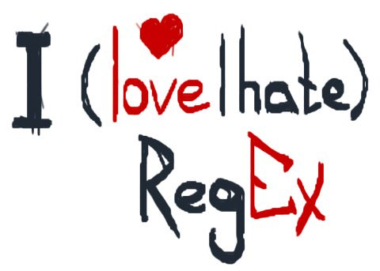

## What is a regular expression?

**Regular expressions** (shortened as **regex** or **regexp**) refer to a formal language for matching and replacing sequences of characters with specific patterns. Many text editors such as Google Docs, Notepad++, Sublime, Geany, Brackets, Atom, etc. support regular expressions. They can be very useful for validating, cleaning, and restructuring text data.

A regular expression can be as simple as a single character or word, but it can sometimes turn into a wall of brackets. However scary regex may look at first glance, their syntax is not that complicated at all!

### Selecting and Grouping Symbols

* **.** - any character
* **\|** - _either_ everything on the left, _or_ what's on the right
* **\(\)** - grouping of characters \(if in doubt about whether to use them, it's better to use them :\) 

The part of the regex enclosed in parentheses is called a **group**. Groups are numbered by the opening parenthesis.

* **\1** - group with the corresponding number \(used in replacement\)
* **\[ \]** - any single character from those enclosed in brackets
* **\[^ \]** - any single character except those enclosed in brackets

### Quantitative Operators (Quantifiers)

* **?** - the previous character/group may or may not be present
* **+** - the previous character/group may repeat 1 or more times
* **\*** - the previous character/group may repeat 0 or more times
* **{n,m}** - the previous character/group may repeat from n to m times, inclusive
* **{n,}** - the previous character/group in parentheses may repeat n or more times
* **{,m}** - the previous character/group may repeat up to m times
* **{n}** - the previous character/group repeats n times

### Symbol Classes (Ranges)

* **\[A-Z\]** - _any one_ uppercase character \(Latin alphabet\)
* **\[a-z\]** - any lowercase character \(Latin alphabet\)
* **\[А-Я\]** - any uppercase character \(Cyrillic alphabet\)
* **\[а-я\]** - any lowercase character \(Cyrillic alphabet\)
* **\[0-9\]** or **\d** - a digit
* **\[^0-9\]** or **\D** - any character except a digit

You can combine them:

* **\[A-Za-z\]** - any uppercase or lowercase character \(Latin alphabet\)
* **\[A-Za-z0-9\]** - any uppercase or lowercase character \(Latin alphabet\) and digits
* **\[A-Za-z0-9\_\]** or **\w** - any uppercase or lowercase character \(Latin alphabet\), digits, and _
* **\[^A-Za-z0-9\_\]** or **\W** - anything except uppercase or lowercase characters \(Latin alphabet\), digits, and _

#### Special characters

* **\t** - tab
* **\s** - any whitespace character
* **\S** - anything except spaces
* **\n** \(or **\r\n** on Windows\) - new line
* **^** - start of the line
* **$** - end of the line

### "Greedy" and "Lazy" Operators

Quantifiers by default behave greedily: this means that they try to "consume" as many characters as possible and, out of all possible options, they will catch the longest string. 

| Greedy Quantifiers   | Lazy Quantifiers   |
| :---                 | :---               |
| \*                   | \*?                |
| +                    | +?                 |
| ?                    | ??                 |
| {min, max}           | {min, max}?        |

### Escaping Special Characters

As you've already noticed, like any language, regular expressions are written using a special alphabet—dots, asterisks, parentheses, etc. But what if you need to find special characters like + or \* in the text? It's simple: you need to **escape** them by placing a backslash \ (backslash) before them. In this example, we escape \* to make it a literal text character, while + remains a special character and means "one or more times".

### Backreferences

## Cheatsheets

## Regex testers
When using these websites websites, you'll see both the matches and a detailed explanation of your regular expression.

* https://regex101.com/
* http://regexr.com/
* http://myregexp.com/
* https://www.regexpal.com/

## Practice

* https://regexcrossword.com/
* https://regexone.com/

## Documentation
* [Regex in Google Docs](https://support.google.com/a/answer/1371415?hl=en)
* [Regex in Python](https://docs.python.org/3/howto/regex.html)
* [Regex in R](https://cran.r-project.org/web/packages/stringr/vignettes/regular-expressions.html)
* [Regex in Java](https://docs.oracle.com/javase/tutorial/essential/regex/)
* [Regex in JavaScript](https://developer.mozilla.org/en-US/docs/Web/JavaScript/Guide/Regular_expressions)
