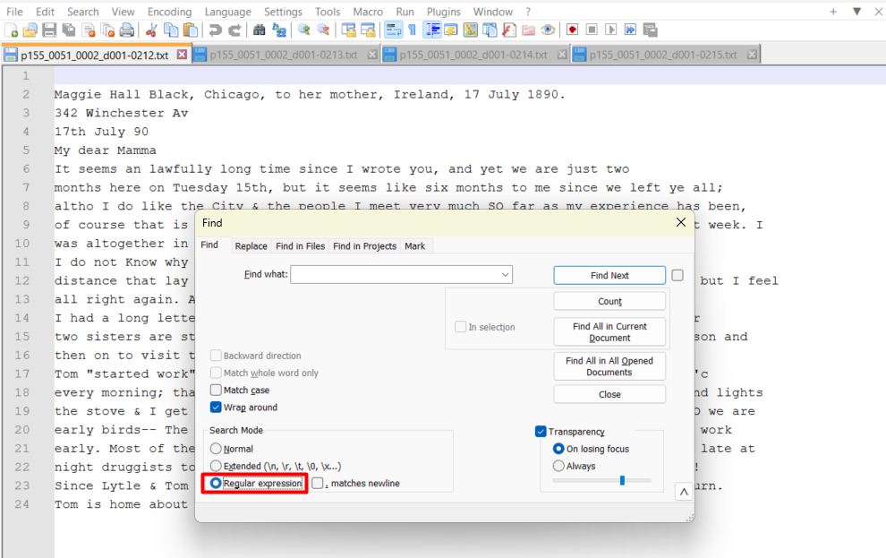
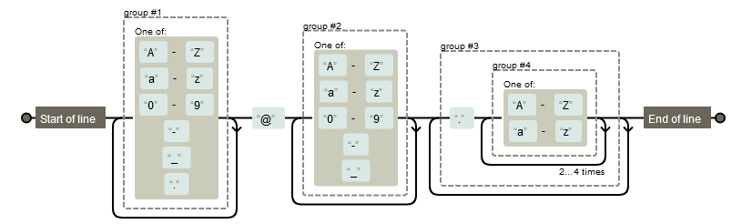

# Regular Expressions

**Regular expressions** (shortened as **regex** or **regexp**) refer to a formal language for matching and replacing sequences of characters with specific patterns. Many text editors such as Google Docs, Notepad++, Sublime, Geany, Brackets, Atom, etc. support regular expressions. They can be very useful for validating, cleaning, and restructuring text data.

## Turning on regex mode in a text editor

* Ctrl+F — search
* Ctrl+H — replace

### Notepad++

&nbsp;&nbsp;&nbsp;

### Sublime Text
&nbsp;&nbsp;&nbsp;

Alternatively, you can use https://regex101.com/ or any other online regex tester. These websites are great for learning, because they provide a detailed explanation for every bit of your regular expression.


## How does a regular expression look like?
A regular expression can be as simple as a single character or word, just like in the standard search. 


However, regular expressions more often look like something your cat typed jumping on the keyboard, or just like a wall of brackets. Although they may seem intimidating at first glance, their syntax is actually quite straightforward!

&nbsp;&nbsp;&nbsp;

## Regex Syntax

### Symbol ranges

| Syntax   | Description                                    |
|:-----------|:------------------------------------------------|
| **.**     | any single character                           |
| **A\|B**  | match either A (everything on the left) or B (everything on the right)
| **[ABC]**             | any single character from those in brackets           |
| **[^ABC]**            | any single character *except* those enclosed in brackets     
| **[A-Z]**     | any single uppercase [basic Latin](https://en.wikipedia.org/wiki/Basic_Latin_(Unicode_block)) character        |
| **[a-z]**     | any single lowercase basic Latin character              |
| **[0-9]** or **\d**| a single digit                                         |
| **[^0-9]** or **\D**| any single character *except* a digit                    |
 
You can combine ranges:

| Syntax   | Description                                    |
|:-----------|:------------------------------------------------|
| **[A-Za-z]**               | any single uppercase or lowercase character from basic Latin alphabet                          |
| **[A-Za-z0-9]**            | any single uppercase or lowercase character from basic Latin alphabet, and digits               |
| **[A-Za-z0-9_]** or **\w**| any single uppercase or lowercase character from basic Latin alphabet, digits, and _            |
| **[^A-Za-z0-9_]** or **\W**| any single character *except* uppercase or lowercase basic Latin characters, digits, and _ |

**Tip**: regular expressions operate Unicode symbol ranges, and you can create custom ones using [Unicode blocks](https://www.compart.com/en/unicode/block) as reference.

| Syntax   | Description                                    |
|:-----------|:------------------------------------------------|
| **[А-Я]**     | any uppercase character from basic Cyrillic alphabet           |
| **[а-я]**     | any lowercase character from basic Cyrillic alphabet           |
| **[\u1680-\u169c]** | Ogham alphabet |
|**[\u0250-\u02af]**| International Phonetic Alphabet (IPA) |

### Groups and backreferencing

A part of a pattern can be enclosed in parentheses. This is called a **capturing group**. You can later refer to this group by its number, for example, when you need to swap chunks of text.

| Syntax   | Description                                    |
|:-----------|:------------------------------------------------|
| **( )**                        | capturing group                                                                |
| **(? )**                       | non-capturing (passive) group                                                   |
| **\1**                         | group with the corresponding number     

Groups are numbered by the opening parenthesis.


Here is an example of swapping AB and BA using capturing groups:


### Quantifiers

| Syntax   | Description                                    |
|:-----------|:------------------------------------------------|
| **?**                          | the previous character/group may or may not be present                         |
| **+**                          | the previous character/group may repeat 1 or more times                        |
| **\***                         | the previous character/group may repeat 0 or more times                        |
| **{N,M}**                      | the previous character/group may repeat from N to M times, inclusive           |
| **{N,}**                       | the previous character/group may repeat N or more times                        |
| **{,M}**                       | the previous character/group may repeat from zero to M times                          |
| **{N}**                        | the previous character/group repeats exactly N times 

#### "Greedy" and "lazy" quantifiers

Quantifiers by default behave greedily: this means that they try to "consume" as many characters as possible and, out of all possible options, return the longest string. To make a quantifier "lazy", i.e. matching the shortest possible string, you need to add a **?** after that quantifier.

| Greedy Quantifiers   | Lazy Quantifiers   |
| :---                 | :---               |
| \*                   | \*?                |
| +                    | +?                 |
| ?                    | ??                 |
| {min, max}           | {min, max}?        |


### Special characters

| Syntax   | Description                                    |
|:-----------|:------------------------------------------------|
| **\t**                         | tab                                                                            |
| **\r**                         | carriage return                                                                |
| **\n**                         | new line   
| **\s**                         | any whitespace character                                                       |
| **\S**                         | anything except spaces  

### Anchors 

| Syntax   | Description                                    |
|:-----------|:------------------------------------------------|
| **^**                          | start of the line                                                              |
| **$**                          | end of the line    

### Escaping syntax elements

As you've already noticed, like any language, regular expressions are written using a special alphabet—dots, asterisks, parentheses, etc. But what if you need to find special characters like + or \* in the text? It's simple: you need to **escape** them by placing a backslash before them.


**NB!** Within square brackets (a range), syntax elements loose their power, and you don't have to escape them.

* `.*?` — matches any character any times from 0 to infinity, as few times as possible (lazy)
* `\.\*\?` — matches a sequence of 3 characters **.*?** literally
* `[.*?]`— matches a single character that can be either a dot, or an asterisk, or a question mark

## Being cautious

Regex can be very helpful, but you can also easily ruin your data with them — especially if you are bulk-processing many files. Always double-check your regular expression on test data before making irreversible changes! 

The most dangerous pattern is `.*`: "any character any times from 0 to infinity, as many times as possible (greedy)". By itself, it will just match a whole string! The "any character any times" bit doesn't mean that the same character has to be repeated. The quantifier applies to the regex element ("any character"), not to a particular match!

&nbsp;&nbsp;&nbsp;

## Exercises 

#### Exercise 1
What will the following regex match? What do you have to change to capture phrases "I love regex!" and "I hate regex!"? Make another change for the regex to capture any of these phrases with one or more exclamation marks.

```
I love|hate regex!
```
#### Exercise 2
When Irish placenames are anglicised, there can emerge multiple spellings of the same name. The town of Cathair Saidhbhín is usually anglicised as Cahersiveen or Cahirciveen. Write a regex to capture both of these spelling. What other potential spellings will this regex capture?

#### Exercise 3
Using [Unicode blocks](https://www.compart.com/en/unicode/block), write a regex to match:

* Devanagari alphabet
* All Georgian characters (main + extended + supplement)
* Greek and Coptic alphabet + Ancient Greek numbers
  
#### Exercise 4

Irish names can be spelled in many different ways. Write a regex to capture all spellings of the name Pádraig listed below:
- Padraig
- Pádraic
- Padraic
- Pádhraig
- Padhraig
- Padraigh
- Padhraic
- Pádhraic
- Páraic

#### Exercise 5
One of the most common uses of regex is email validation. Try to write a regex for capturing emails using the visualisation below for reference. The visualisation was made with Regexper: https://regexper.com/



<details>
  <summary>Answer</summary>

  Assuming you would like to capture only emails that take up the whole line (i.e. start at the beginning of the line and end at the end of the line), like in the picture:

`^([A-Za-z0-9-_.])+@([A-Za-z0-9-_])+(\.([A-Za-z]){2,4})+$`

However, this is a simplified version. A regular expression that would *actually* capture *most* email addresses, [looks like this](https://emailregex.com/):

```
(?:[a-z0-9!#$%&'*+/=?^_`{|}~-]+(?:\.[a-z0-9!#$%&'*+/=?^_`{|}~-]+)*|"(?:[\x01-\x08\x0b\x0c\x0e-\x1f\x21\x23-\x5b\x5d-\x7f]|\\[\x01-\x09\x0b\x0c\x0e-\x7f])*")@(?:(?:[a-z0-9](?:[a-z0-9-]*[a-z0-9])?\.)+[a-z0-9](?:[a-z0-9-]*[a-z0-9])?|\[(?:(?:25[0-5]|2[0-4][0-9]|[01]?[0-9][0-9]?)\.){3}(?:25[0-5]|2[0-4][0-9]|[01]?[0-9][0-9]?|[a-z0-9-]*[a-z0-9]:(?:[\x01-\x08\x0b\x0c\x0e-\x1f\x21-\x5a\x53-\x7f]|\\[\x01-\x09\x0b\x0c\x0e-\x7f])+)\])
```


</details>

#### Exercise 6

Download [p155_0071_0009_d001.txt](https://github.com/universityofgalway-library/digital-tools-workshops/blob/main/regular-expressions/data/p155_0071_0009_d001.txt) and [p155_0071_0009_d002.txt](https://github.com/universityofgalway-library/digital-tools-workshops/blob/main/regular-expressions/data/p155_0071_0009_d002.txt). These are two pages of a letter from the [Imirce project](https://imirce.universityofgalway.ie/p/ms). Using a text editor,

* Find all mentions of Ireland and Irishmen in both documents in English.
* Find all mentions of Ireland and Irishmen in both documents in Irish (tip: look for *Eire, Eireann, hEireann, Eireannach, Eireannaigh, Eirinn*). What if you had to catch standard spellings with an **É** too (*Éire, Éireann* etc.)?
* Replace all 7 and & with 'agus' ('and') in both documents; keep in mind that there should be whitespaces around 7 or & for them to qualify for replacement!
* The letter is written in the old orthography. For example, the words *brisde, uachdarán, agad* are spelled with a **t** instead of a **d** now, and the words *taisbeáint, oisbideal* are spelled with a **p** instead of a **b**. Can you use regular expressions to modernise the spelling of these words in the text? Why?


## Cheatsheets

* [David Child's Regex Cheatsheet](https://github.com/universityofgalway-library/digital-tools-workshops/blob/main/regular-expressions/davechild_regular-expressions.pdf)
* [DataCamp Regex Cheatsheet](https://github.com/universityofgalway-library/digital-tools-workshops/blob/main/regular-expressions/Regular_Expressions_Cheat_Sheet.pdf)

## Regex testers
When using these websites, you'll see both the matches and a detailed explanation of your regular expression.

* https://regex101.com/
* http://regexr.com/
* http://myregexp.com/
* https://www.regexpal.com/

## Practice

* https://regexcrossword.com/
* https://regexone.com/

## Regex library
This website provides a library of regular expressions, which you can search by keywords, e.g. 'time': https://regexlib.com/ 


## Documentation
* [Regex in Google Docs](https://support.google.com/a/answer/1371415?hl=en)
* [Regex in Python](https://docs.python.org/3/howto/regex.html)
* [Regex in R](https://cran.r-project.org/web/packages/stringr/vignettes/regular-expressions.html)
* [Regex in Java](https://docs.oracle.com/javase/tutorial/essential/regex/)
* [Regex in JavaScript](https://developer.mozilla.org/en-US/docs/Web/JavaScript/Guide/Regular_expressions)
